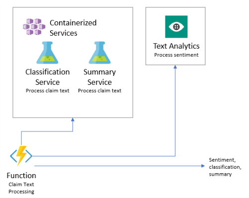

<div class="MCWHeader1">
Cognitive services and deep learning
</div>

<div class="MCWHeader2">
Whiteboard design session trainer guide
</div>

<div class="MCWHeader3">
March 2019
</div>

Information in this document, including URL and other Internet Web site references, is subject to change without notice. Unless otherwise noted, the example companies, organizations, products, domain names, e-mail addresses, logos, people, places, and events depicted herein are fictitious, and no association with any real company, organization, product, domain name, e-mail address, logo, person, place or event is intended or should be inferred. Complying with all applicable copyright laws is the responsibility of the user. Without limiting the rights under copyright, no part of this document may be reproduced, stored in or introduced into a retrieval system, or transmitted in any form or by any means (electronic, mechanical, photocopying, recording, or otherwise), or for any purpose, without the express written permission of Microsoft Corporation.

Microsoft may have patents, patent applications, trademarks, copyrights, or other intellectual property rights covering subject matter in this document. Except as expressly provided in any written license agreement from Microsoft, the furnishing of this document does not give you any license to these patents, trademarks, copyrights, or other intellectual property.

The names of manufacturers, products, or URLs are provided for informational purposes only, and Microsoft makes no representations and warranties, either expressed, implied, or statutory, regarding these manufacturers or the use of the products with any Microsoft technologies. The inclusion of a manufacturer or product does not imply endorsement of Microsoft of the manufacturer or product. Links may be provided to third-party sites. Such sites are not under the control of Microsoft and Microsoft is not responsible for the contents of any linked site or any link contained in a linked site, or any changes or updates to such sites. Microsoft is not responsible for webcasting or any other form of transmission received from any linked site. Microsoft is providing these links to you only as a convenience, and the inclusion of any link does not imply endorsement of Microsoft of the site or the products contained therein.

© 2019 Microsoft Corporation. All rights reserved.

Microsoft and the trademarks listed at <https://www.microsoft.com/en-us/legal/intellectualproperty/Trademarks/Usage/General.aspx> are trademarks of the Microsoft group of companies. All other trademarks are the property of their respective owners.

# Cognitive services and deep learning whiteboard design session trainer guide

## Contents

- [Cognitive services and deep learning whiteboard design session trainer guide](#cognitive-services-and-deep-learning-whiteboard-design-session-trainer-guide)
  - [Contents](#contents)
- [Trainer information](#trainer-information)
  - [Role of the trainer](#role-of-the-trainer)
  - [Whiteboard design session flow](#whiteboard-design-session-flow)
  - [Before the whiteboard design session: How to prepare](#before-the-whiteboard-design-session-how-to-prepare)
  - [During the whiteboard design session: Tips for an effective whiteboard design session](#during-the-whiteboard-design-session-tips-for-an-effective-whiteboard-design-session)
- [Cognitive services and deep learning whiteboard design session student guide](#cognitive-services-and-deep-learning-whiteboard-design-session-student-guide)
  - [Abstract and learning objectives](#abstract-and-learning-objectives)
  - [Step 1: Review the customer case study](#step-1-review-the-customer-case-study)
    - [Customer situation](#customer-situation)
    - [Customer needs](#customer-needs)
    - [Customer objections](#customer-objections)
    - [Infographic for common scenarios](#infographic-for-common-scenarios)
  - [Step 2: Design a proof of concept solution](#step-2-design-a-proof-of-concept-solution)
  - [Step 3: Present the solution](#step-3-present-the-solution)
  - [Wrap-up](#wrap-up)
  - [Additional references](#additional-references)
- [Cognitive services and deep learning whiteboard design session trainer guide](#cognitive-services-and-deep-learning-whiteboard-design-session-trainer-guide-1)
  - [Step 1: Review the customer case study](#step-1-review-the-customer-case-study-1)
  - [Step 2: Design a proof of concept solution](#step-2-design-a-proof-of-concept-solution-1)
  - [Step 3: Present the solution](#step-3-present-the-solution-1)
  - [Wrap-up](#wrap-up-1)
  - [Preferred target audience](#preferred-target-audience)
  - [Preferred solution](#preferred-solution)
  - [Checklist of preferred objection handling](#checklist-of-preferred-objection-handling)
  - [Customer quote (to be read back to the attendees at the end)](#customer-quote-to-be-read-back-to-the-attendees-at-the-end)

# Trainer information

Thank you for taking time to support the whiteboard design sessions as a trainer!

## Role of the trainer

An amazing trainer:

-   Creates a safe environment in which learning can take place

-   Stimulates the participant's thinking

-   Involves the participant in the learning process

-   Manages the learning process (on time, on topic, and adjusting to benefit participants)

-   Ensures individual participant accountability

-   Ties it all together for the participant

-   Provides insight and experience to the learning process

-   Effectively leads the whiteboard design session discussion

-   Monitors quality and appropriateness of participant deliverables

-   Effectively leads the feedback process

## Whiteboard design session flow

Each whiteboard design session uses the following flow:

**Step 1: Review the customer case study (15 minutes)**

Outcome: Analyze your customer's needs

-   Customer's background, situation, needs and technical requirements

-   Current customer infrastructure and architecture

-   Potential issues, objectives and blockers

**Step 2: Design a proof of concept solution (60 minutes)**

Outcome: Design a solution and prepare to present the solution to the target customer audience in a 15-minute chalk-talk format.

-   Determine your target customer audience

-   Determine customer's business needs to address your solution

-   Design and diagram your solution

-   Prepare to present your solution

**Step 3: Present the solution (30 minutes)**

Outcome: Present solution to your customer

-   Present solution

-   Respond to customer objections

-   Receive feedback

**Wrap-up (15 minutes)**

-   Review preferred solution

## Before the whiteboard design session: How to prepare

Before conducting your first whiteboard design session:

-   Read the Student guide (including the case study) and Trainer guide

-   Become familiar with all key points and activities

-   Plan the point you want to stress, which questions you want to drive, transitions, and be ready to answer questions

-   Prior to the whiteboard design session, discuss the case study to pick up more ideas

-   Make notes for later

## During the whiteboard design session: Tips for an effective whiteboard design session

**Refer to the Trainer guide** to stay on track and observe the timings.

**Do not expect to memorize every detail** of the whiteboard design session.

When participants are doing activities, you can **look ahead to refresh your memory**.

-   **Adjust activity and whiteboard design session pace** as needed to allow time for presenting, feedback, and sharing

-   **Add examples, points, and stories** from your own experience. Think about stories you can share that help you make your points clearly and effectively.

-   **Consider creating a "parking lot"** to record issues or questions raised that are outside the scope of the whiteboard design session or can be answered later. Decide how you will address these issues, so you can acknowledge them without being derailed by them.

***Have fun**! Encourage participants to have fun and share!*

**Involve your participants.** Talk and share your knowledge but always involve your participants, even while you are the one speaking.

**Ask questions** and get them to share to fully involve your group in the learning process.

**Ask first**, whenever possible. Before launching into a topic, learn your audience's opinions about it and experiences with it. Asking first enables you to assess their level of knowledge and experience and leaves them more open to what you are presenting.

**Wait for responses**. If you ask a question such as, "What's your experience with (fill in the blank)?" then wait. Do not be afraid of a little silence. If you leap into the silence, your participants will feel you are not serious about involving them and will become passive. Give participants a chance to think, and if no one answers, patiently ask again. You will usually get a response.

#  Cognitive services and deep learning whiteboard design session student guide

## Abstract and learning objectives 

In this whiteboard design session, you will work with a group to design a solution which combines both pre-built artificial intelligence (AI) in the form of various Cognitive Services, with custom AI in the form of services built and deployed with Azure Machine Learning service. You will learn to create intelligent solutions atop unstructured text data by designing and implementing a text analytics pipeline. You will discover how to build a binary classifier using a simple neural network that can be used to classify the textual data, as well as how to deploy multiple kinds of predictive services using Azure Machine Learning service and learn to integrate with the Computer Vision API and the Text Analytics API from Cognitive Services.

At the end of this whiteboard design session, you will be better able to design solutions leveraging the Azure Machine Learning service and Cognitive Services.

## Step 1: Review the customer case study 

**Outcome** 

Analyze your customer’s needs.

Timeframe: 15 minutes 

Directions: With all participants in the session, the facilitator/SME presents an overview of the customer case study along with technical tips. 

1.  Meet your table participants and trainer 
2.  Read all of the directions for steps 1–3 in the student guide 
3.  As a table team, review the following customer case study

### Customer situation

Contoso Ltd is a large corporation, headquartered in the United States that provides insurance packages for U.S. consumers. Its products include accident and health insurance, life insurance, travel, home, and auto coverage.

Contoso is looking to build a next-generation platform for its insurance products and had identified claims processing as the first area in which they would like to focus their efforts. Currently customers submit a claim using either the website, their mobile app or by speaking with a live agent.

A claim includes the following information:

-   Information about the insured (contact information, policy number, etc.)

-   Free text responses describing the claim (details of what happened, what was affected, the conditions in which it occurred)

-   Photographs that support the claim (photos of the insured object before the event, photos of the damage or stolen items, etc.)

When an agent (an employee or contractor of Contoso) is processing a claim, there are multiple challenges that add significantly to the cost, including the significant time it takes for an agent to read through and process the content submitted with each claim, as well as the difficulty they have in finding particular claim artifacts when returning to a claim after a while. While each claim is stored in a database, the details about the claim, including the free text responses and supporting photos, are stored as opaque attachments that are not searchable - meaning agents typically pull up the claim by the claim number or the insured's contact information and then must manually read through the attachments.

Also, there are some common challenges that Contoso is hoping they could automate away. According to Francine Fischer, CIO, there are two sets of issues where they envision amplifying the capabilities of their agents with AI.

One set of such issues deals with the free text responses. The first issue Contoso identified is that each claim detail should be automatically classified as either home or auto based on the text. This classification would be displayed in the claim summary, so an agent can quickly assess whether they are dealing with purely a home claim, an auto claim or a claim that has a mixture of the two.

The second issue is Contoso would like to experiment applying sentiment analysis to the claim text. They know most customers are either  factual in their description (a neutral sentiment) or slightly unhappy (a more negative sentiment), but believe that a negative sentiment can be an indicator to claim text that involves a more severe situation, which might warrant an expedited review by an agent.

The third issue with the free text is that some of the responses are long. When agents are shifting between claims, it can be hard for them to recall which response had the details for which they are looking. Contoso would like to experiment with an automatic summarization of long claims that produces a summary of about 30 words in length. This summarization would enable the agent to get the gist before having to read the full claim and can quickly remind themselves of the claim when revisiting it.

The next set of issues where they would like to amplify the capabilities of their agents have to deal with extracting information from the photos submitted to increase their searchability. The first item they would like to address is providing automatic captions describing the contents of the photo. Second, they would like to automatically apply tags that describe the content of the photo. Third, the solution should try to pull out any text that appears in the image. Taken together, solving these items can reduce the amount of data entry an agent has to do, while simultaneously increasing the searchability for content present in photos.

As a final step, they would like to organize the information extracted from photos, tying it together with the results of processing the free text responses into a solution that is easily searchable and stays up to date as new claim information surfaces.

As a first step towards their bigger goals, Contoso would like to build a proof of concept (PoC) for an intelligent solution that could automate all the above. They would like to build this PoC to build upon their claims submission solution they already have running in Azure (which consists of a Web App for claims submission and a SQL Database for claim storage). They believe this might be possible using AI, machine learning or deep learning and would like to build a proof of concept to understand just how far they can go using these technologies.

### Customer needs 

1.  We receive a lot of useful information in the free text responses, but because they can be long, agents sometimes skip over them and miss vital details or spend too much time looking for a particular detail when returning to a claim. We aren't certain this can be automated, but we would like to have a standardized process that identifies the key entities in a claim and pulls them out into a separate list that agents can more easily review, and then click to view the entity in the context of the claim.

2.  We need a solution that can "look" at a photo and give us a description of the photos contents and tag the photos with keywords, so agents can more easily find and refer to the photo later

3.  We are looking to amplify the capabilities of our agents and improve their claims processing capabilities - not replace them. We want a solution that does the same.


### Customer objections 

1.  We are skeptical about all the hype surrounding these "AI" solutions. It's hard to know what is feasible versus what is not possible with today's technology and Azure.

2.  We know that are both pre-built AI and custom AI options available. We are confused as to when to choose one over the other.

3.  We expect some part of our solution would require deep learning. Do you have any prescriptive guidance on how we might choose between investing in learning and using TensorFlow or the Microsoft Cognitive Toolkit (CNTK)?


### Infographic for common scenarios


## Step 2: Design a proof of concept solution

**Outcome** 
Design a solution and prepare to present the solution to the target customer audience in a 15-minute chalk-talk format. 

Timeframe: 60 minutes

**Business needs**

Directions: With all participants at your table, answer the following questions and list the answers on a flip chart. 

1.  Who should you present this solution to? Who is your target customer audience? Who are the decision makers? 
2.  What customer business needs do you need to address with your solution?

**Design** 

Directions: With all participants at your table, respond to the following questions on a flip chart.

_High-level architecture_

1.  Without getting into the details (the following sections will address the details), diagram your initial vision for handling the top-level requirements for processing the claims textual data, photos, and enabling search. You will refine this diagram as you proceed.

_Classifying claim-text data_

1.  What is the general pipeline for approaching the training of text analytic models such as this? What are the general steps you need to take to prepare the text data for performing tasks like classification?

2.  What data would they need to train the model?

3.  Contoso understands they should use a classification algorithm for this problem. They have asked if a Deep Neural Network could be trained against the text to recognize home or auto classifications. Could they use a DNN for this?

4.  For this scenario, Contoso has indicated an interest in using TensorFlow, but is concerned about the complexity of jumping right in. They are wondering if TFLearn would provide an easier framework they could use as a stepping stone to the full blown TensorFlow, that would enable them to build TensorFlow compatible models so that they can "graduate" to using TensorFlow when the team is ready?

5.  What would a very simple DNN that performs this classification look like? Sketch the graph of input nodes, hidden layer nodes, and output nodes.

6.  Assuming they will be using a fully connected DNN with a softmax activation function to train the classifier using a regression and  TFLearn, pseudo code the code you would write to construct the network you just illustrated.

7.  Next, pseudo code how they would construct the DNN from the network and fit the model to the data

8.  With the trained model in hand, pseudo code how the model would be used to predict the class of a given claim text. What would the output of the prediction be? How would you interpret the value?

9.  Describe at a high level, how you would deploy this trained model, so it is available as a web service that can be integrated with the rest of the solution.

_Identifying free-text sentiment_

1.  How would you recommend Contoso identify the sentiment in the free-response text provided associated with a claim? Would this require you to build a custom AI model? Is there a pre-built AI service you could use?

2.  For the solution you propose, what is the range of value of the sentiment score and how would you interpret that value?

_Summarizing claim text_

1.  The team at Contoso has heard about a Python library called gensim that has a summarize function. Given an input of text, it can extract a summary of the desired length. Contoso would like their PoC to implement its summarization functionality initially using gensim. However, the process they follow to deploy the summarization capability should also enable them to replace the use of gensim with another library or with the use of their own custom trained models if desired down the road. Describe how Contoso should deploy the summarization service to meet these requirements?

2.  Can they deploy a predictive web service to Azure Machine Learning service that does not utilize an external model (as in the case with gensim) or would support an unsupervised approach?

_Captions, tags and "reading" images_

1.  How would you recommend Contoso implement support for automatically creating captions for the claim photos? Similarly, how would they automatically generate tags? Would this require you to build a custom AI model? Is there a pre-built AI service you could use?

2.  Describe the flow of processing of an image as input; what value is returned by each component in your proposed solution for captioning and tagging images?

3.  How would you recommend Contoso implement support for "reading" any text that appears within an image, so that it could be searched later? Would this require you to build a custom AI model? Is there a pre-built AI service you could use?

4.  Describe the flow of processing of an image as input; what value is returned by each component in your proposed solution for "reading" images?

_Enabling search_

1.  What service would you recommend Contoso leverage to enable greater searchability over the claim data, inclusive of the new data fields created by your text processing and image processing components?

2.  Would they be able to keep their claims data in the existing database and layer in this search capability? If so, explain how.

**Prepare**

Directions: With all participants at your table: 

1.  Identify any customer needs that are not addressed with the proposed solution 
2.  Identify the benefits of your solution
3.  Determine how you will respond to the customer’s objections 

Prepare a 15-minute chalk-talk style presentation to the customer. 

## Step 3: Present the solution

**Outcome**
 
Present a solution to the target customer audience in a 15-minute chalk-talk format.

Timeframe: 30 minutes

**Presentation** 

Directions:

1.  Pair with another table
2.  One table is the Microsoft team and the other table is the customer
3.  The Microsoft team presents their proposed solution to the customer
4.  The customer makes one of the objections from the list of objections
5.  The Microsoft team responds to the objection
6.  The customer team gives feedback to the Microsoft team
7.  Tables switch roles and repeat Steps 2–6


##  Wrap-up 

Timeframe: 15 minutes

Directions: Tables reconvene with the larger group to hear the facilitator/SME share the preferred solution for the case study. 

##  Additional references


|                                                       |                                                                                                   |
| ----------------------------------------------------- | ------------------------------------------------------------------------------------------------- |
| **Description**                                       | **Links**                                                                                         |
| Azure Machine Learning service                        | <https://docs.microsoft.com/en-us/azure/machine-learning/service/overview-what-is-azure-ml>       |  |
| Deploying Web Services                                | <https://docs.microsoft.com/en-us/azure/machine-learning/preview/model-management-service-deploy> |
| Overview of TFLearn                                   | <http://tflearn.org/>                                                                             |
| Overview of TensorFlow                                | <https://www.tensorflow.org/>                                                                     |
| Overview of gensim library                            | <https://radimrehurek.com/gensim/>                                                                |
| Overview of the Computer Vision API Cognitive Service | <https://docs.microsoft.com/en-us/azure/cognitive-services/computer-vision/home>                  |
| Overview of the Text Analytics API Cognitive Service  | <https://docs.microsoft.com/en-us/azure/cognitive-services/text-analytics/overview>               |


# Cognitive services and deep learning whiteboard design session trainer guide

## Step 1: Review the customer case study

-   Check in with your table participants to introduce yourself as the trainer

-   Ask, "What questions do you have about the customer case study?"

-   Briefly review the steps and timeframes of the whiteboard design session

-   Ready, set, go! Let the table participants begin

## Step 2: Design a proof of concept solution

-   Check in with your tables to ensure that they are transitioning from step to step on time

-   Provide some feedback on their responses to the business needs and design

    -   Try asking questions first that will lead the participants to discover the answers on their own

-   Provide feedback for their responses to the customer's objections

    -   Try asking questions first that will lead the participants to discover the answers on their own

## Step 3: Present the solution

-   Determine which table will be paired with your table before Step 3 begins

-   For the first round, assign one table as the Microsoft team and the other table as the customer

-   Have the presenting team present their solution to the customer team 

    -   Have the customer team provide one objection for the presenting team to respond to

    -   The presentation, objections, and feedback should take no longer than 15 minutes

    -   If needed, the trainer may also provide feedback

## Wrap-up

-   Have the table participants reconvene with the larger session group to hear the facilitator/SME share the following preferred solution

##  Preferred target audience

Francine Fischer, CIO of Contoso Ltd.

The primary audience is the business decision makers and technology decision makers. From the case study scenario, this would include the Director of Analytics. Usually we talk to the infrastructure managers, who report to the chief information officers (CIOs), or to application sponsors (like a vice president \[VP\] line of business \[LOB\], or chief marketing officer \[CMO\]), or to those that represent the business unit IT or developers that report to application sponsors.

## Preferred solution

_High-level architecture_

1.  Without getting into the details (the following sections will address the details), diagram your initial vision for handling the top-level requirements for processing the claims textual data, photos, and enabling search. You will refine this diagram as you proceed.

After speaking with its team at Microsoft, Contoso decided to design their PoC solution in Azure. They would continue to use the web app and SQL database that they already have running in Azure to handle claim submissions. They could build a claim enrichment pipeline by invoking a sequence of Azure Functions, where each of the coordinates calls to various AI-powered services.

 

The claim image processing functions would invoke the Computer Vision Cognitive Service for automatically creating the caption and the tags from any supplied claim images. A mixture of pre-built AI, in the form of Cognitive Services and custom AI in the form of Azure ML services, would be used to process the claim text. The models used for processing the claims text would be trained in Azure Databricks notebooks. These models could also then be directly deployed from Azure Databricks using the Azure Machine Learning Service Python SDK. Azure Functions would be used to coordinate the calls to the classifications and summary AI services, which would run as containerized web services in Azure Container Service, while the Text Analytics API could be invoked directly to provide a sentiment score for each claim text.

 

Once all claim processing has completed, one final Azure Function could be used to insert the complete claim document into Azure Search. The inserted document would contain the claim number as a field so that it could always be tied back to the record store in Azure SQL Database.

_Classifying claim text data_

1.  What is the general pipeline for approaching the training of text analytic models such as this? What are the general steps you need to take to prepare the text data for performing tasks like classification?

    

    As the above diagram illustrates, the general pipeline begins by pre-processing or normalizing the text. This step typically includes tasks such as breaking the text into sentence and word tokens, standardizing the spelling of words, and removing overly common words (called stop words). The output of this phase is typically a multi-dimensional array consisting of an array of documents, each having an array of sentences, with each sentence having its own array of words. The next step is feature extraction, which creates a numeric representation of the textual documents. During feature extraction, a "vocabulary" of unique words is identified, and each word becomes a column in the output. Each row represents a document. The value in each cell is typically a measure of the relative importance of that word in the document, where if a word from the vocabulary does not appear, then that cell has a zero value in that column. This approach enables machine learning algorithms, which operate against arrays of numbers, to also operate against text. Deep learning algorithms operate on tensors, which are also vectors (or arrays of numbers), so this approach is also valid for preparing text for use with a deep learning algorithm.

2.  What data would they need to train the model?

    Contoso would need to have a certain amount of historical claim text and have it labeled as home or auto to train a model.

3.  Contoso understands they should use a classification algorithm for this problem. They have asked if a Deep Neural Network could be trained against the text to recognize home or auto classifications? Could they use a DNN for this?

    Yes, they could build a DNN that performs classification against the document tensors (or vectors of word frequencies).

4.  For this scenario, Contoso has indicated an interest in using TensorFlow, but is concerned about the complexity of jumping right in. They are wondering if TFLearn would provide an easier framework they could use as a stepping stone to the full-blown TensorFlow, which would enable them to build TensorFlow compatible models so that they can "graduate" to using TensorFlow when the team is ready.

    TensorFlow is a robust framework for performing machine learning, including building neural networks. The TFLearn library builds upon Tensorflow and provides an easy-to-use and understand high-level API for implementing deep neural networks, complete with tutorials and examples. Models built with TFLearn are TensorFlow models, so if they choose to move fully towards the lower level TensorFlow API's, then they could do so without having to re-create the models.

5.  What would a very simple DNN that performs this classification look like? Sketch the graph of input nodes, hidden layer nodes, and output nodes.

    

6.  Assuming they will be using a fully connected DNN with a softmax activation function to train the classifier using a regression and TFLearn, pseudo code the code you would write to construct the network you just illustrated.

    ```python
    net = tflearn.input_data(shape=[None, ...])

    net = tflearn.fully_connected(net, ...)

    net = tflearn.fully_connected(net, ...)

    net = tflearn.fully_connected(net, 2, activation='softmax')

    net = tflearn.regression(net)
    ```

7.  Next, pseudo code how they would construct the DNN from the network and fit the model to the vectorized data and the labels.

    ```python
    model = tflearn.DNN(net)
    model.fit(data, labels, ...)
    ```

8.  With the trained model in hand, pseudo code how the model would be used to predict the class of a given claim text. What would the output of the prediction be? How would you interpret the value?

    ```python
    test_claim = ['I crashed my car into a pole.']

    test_claim = normalize_text(test_claim)

    test_claim = extract_features(test_claim)
    pred = model.predict(test_claim)
    ```
    The output of pred is an array of the confidence that label is a 0 or a 1. For example:

    ```python
    array([ [0.22, 0.78] ])
    ```

    Could be interpreted to indicate that a prediction of 1 ("auto insurance claim") with a confidence of 78%.

9.  Describe at a high level, how you would deploy this trained model so it is available as a web service that can be integrated with the rest of the solution? What Azure Service(s) would be involved?

    The trained model is saved to a file. Then this file is loaded by web service code that re-creates the DNN and loads the model weights. The web service code can then run classifications using the model. It is important to note that any text provided to the model for classification must still be processed by the normalize and extract features routines, as was done when training the model. You could deploy this service using Azure Machine Learning service, which would capture the web service in a container, and then deploy the container to Azure Container Service where it can be invoked by any REST client.

_Identifying free-text sentiment_

1.  How would you recommend Contoso identify the sentiment in the free-response text provided associated with a claim? Would this require you to build a custom AI model is there a pre-built AI service you could use?

    Contoso should use the Text Analytics API from Cognitive Services for scoring the sentiment of the claim text. By doing so, they would not have to build or train a custom model, nor have the requirement of having the data to do so.

2.  For the solution you propose, what is the range of value of the sentiment score and how would you interpret that value?

    The Text Analytics API returns values in the range of 0 to 1. A value closer to 0 is interpreted as strongly negative sentiment, near 0.5 as neutral sentiment and closer to 1 as strongly positive sentiment.

_Summarizing claim text_

1.  The team at Contoso has heard about a Python library called gensim that has a summarize function. Given an input of text, it is capable of extracting a summary of the desired length. Contoso would like their PoC to implement its summarization functionality initially using gensim. However, the process they follow to deploy the summarization capability should also enable them to replace the use of gensim with another library or with the use of their own custom trained models if desired down the road. Describe how Contoso should deploy the summarization service so that these requirements are met? Can they deploy a predictive web service to Azure Machine Learning service that does not utilize an external model (as in the case with gensim) or would support an unsupervised approach (such as clustering)?

    Azure Machine Learning service can be used to deploy web services that do not have a model. While the API used to perform the deployment requires a model argument, the argument can refer to any file, and it does not require the use of the file during the web service runtime. Therefore, Contoso could deploy a web service that uses gensim to perform summarization.

_Captions, tags and "reading" images_

1.  How would you recommend Contoso implement support for automatically creating captions for the claim photos? Similarly, how would they automatically generate tags? Would this require you to build a custom AI model is there a pre-built AI service you could use?

    For both creating captions and the generation of tags, Contoso should use the analyze feature of the Computer Vision API from Cognitive Services.

2.  Describe the flow of processing of an image as input; to what value is returned by each component in your proposed solution for captioning and tagging images?

    When using the Computer Vision API, either the binary image data or a URL pointing to a publicly accessible image can be supplied. The return value of Computer Vision API is a JSON document that includes the requested fields (such as captions and tags).

     An example of such as JSON response document is as follows:

    ```json
    {'categories': [{'name': 'others_', 'score': 0.39453125},
    {'name': 'trans_car', 'score': 0.44140625}],
    'color': {'accentColor': '895D42',
    'dominantColorBackground': 'White',
    'dominantColorForeground': 'White',
    'dominantColors': ['White'],
    'isBwImg': False},
    'description': {'captions': [{'confidence': 0.9485308427051494,
        'text': 'a truck is parked on the side of a road'}],
    'tags': ['outdoor',
    'road',
    'truck',
    'car',
    'traffic']},
    'metadata': {'format': 'Jpeg', 'height': 1080, 'width': 1920},
    'requestId': '2236f0b9-044f-415f-b772-a9a4ce15728d',
    'tags': [{'confidence': 0.9950141310691833, 'name': 'outdoor'},
    {'confidence': 0.9936342239379883, 'name': 'road'},
    {'confidence': 0.981715738773346, 'name': 'truck'},
    {'confidence': 0.749627411365509, 'name': 'transport'},
    {'confidence': 0.16133838891983032, 'name': 'trailer'}]}

    ```
3.  How would you recommend Contoso implement support for "reading" any text that appears within an image, so it could be searched later? Would this require you to build a custom AI model? Is there a pre-built AI service you could use?

    When attempting to extract text from an image, Contoso could use the OCR feature of the Computer Vision API.

4.  Describe the flow of processing of an image as input, to what value returned by each component in your proposed solution for "reading" images.

    When using the Computer Vision API, either the binary image data or a URL pointing to a publicly accessible image can be supplied. The return value of Computer Vision API for the OCR feature is a JSON document, which includes a collection of bounding boxes that contain the text recognized from the image.

     An example of such as JSON response document is as follows:

    ```json
    {
        'language': 'en',
        'orientation': 'Up',
        'regions': [
            {
                'boundingBox': '365,127,937,78',
                'lines': [
                    {
                        'boundingBox': '1028,127,274,49',
                        'words': [
                            {
                                'boundingBox': '1028,141,184,35',
                                'text': 'POLICE'
                            }
                        ]
                    },
                    {
                        'boundingBox': '365,171,318,34',
                        'words': [
                            {
                                'boundingBox': '365,171,318,34',
                                'text': 'EMERGENCY'
                            }
                        ]
                    }
                ]
            }
        ],
        'textAngle': 0.0
    }
    ```

_Enabling search_

1.  What service would you recommend Contoso use to enable greater searchability over the claim data, inclusive of the new data fields created by your text processing and image processing components?

    Contoso should use Azure Search to create an Index for the claim data as it enters their system and is augmented by the results of the text and image processing components.

2.  Would they be able to keep their claims data in the existing database and layer in this search capability? If so, explain how.

    Yes, the data in the Azure Search index would augment the data already stored in their SQL Database. The data in the Azure Search index would tie back to the data in SQL Database via values used as the primary key in the SQL Database (such as the claim ID, image ID, attachment ID, etc.).

## Checklist of preferred objection handling

1.  We are skeptical about all the hype surrounding these "AI" solutions. It's hard to know what is feasible versus what is not possible with today's technology and Azure.

    While it is true that there is a lot of hype around AI, the ability to deploy solutions that use data, machine learning, and deep learning to create an application with "AI" capabilities is real and is possible in Azure. Azure provides a wide range of services to address the needs of AI from pre-built AI capabilities in Cognitive Services to services that help you to build, train, and deploy your custom AI capabilities using the Azure Machine Learning service and other services from the Microsoft AI stack.

2.  We know that are both pre-built AI and custom AI options. We are confused as to when to choose one over the other?

    You should consider the pre-built AI options first; however, if you rule them out because they are not fitting your requirements,  then you should explore the custom AI options. The advantage of pre-built AI options like Cognitive Services is that the models they use under the covers do not need to be trained by you, and you do not need to have the data to train them as a pre-requisite.

3.  We expect some part of our solution would require deep learning; do you have any prescriptive guidance on how we might choose between investing to learn and use TensorFlow or the Microsoft Cognitive Toolkit (CNTK)?

    Both TensorFlow and the Microsoft Cognitive Toolkit solve similar problems and have been used successfully by many companies for deep learning. At present, it appears that TensorFlow has a much larger community base and interest level, which can be measured simply by the number of stars it has in its GitHub project (which is an order of magnitude larger than that of the Microsoft Cognitive Toolkit). The size of the community means that is likely you will more easily find help online for issues with TensforFlow versus the Microsoft Cognitive Toolkit, which is why it may be a good reason to start with TensorFlow.

## Customer quote (to be read back to the attendees at the end)

*"We are excited by the possibilities made real when we use AI to amplify the capabilities of our agents."*

Francine Fischer, CIO of Contoso Ltd.
